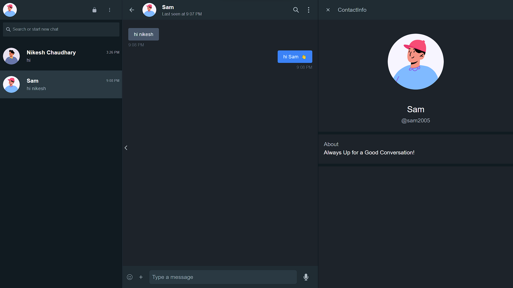

# Buzz hive - A realtime chat-application



Buzz Hive is a cutting-edge real-time chat application that offers seamless communication experiences. Built with React, Express, MongoDB, Tailwind CSS, and powered by Socket.io for lightning-fast messaging.


## 🔮 Features

-   💬 Real-time messaging with other users
-   🔍 Advanced search functionality enabling users to easily find other users
-   📱 Responsive design all users to access the application on any device
-   🔐 Secure authentication and authorization system

## 🚀 Live Preview

You can view the live preview of the project [here](https://buzz-hive-one.vercel.app/).

## 💻 Tech Stack


## ⚙️ Installation

1. **Fork this repository:** Click the Fork button located in the top-right corner of this page to fork the repository.
2. **Clone the repository:**
    ```bash
    git clone https://github.com/Nikeshchaudhary52494/BuzzHive.git
    ```
3. **Set .env file:**
   Create or edit the .env file in backend folder and add the following line:  
   
    ```bash
    PORT
    ```
    ```bash
    MONGO_DB_URI
    ```
    ```bash
    JWT_SECRET
    ```
    ```bash
    JWT_EXPIRE
    ```
    ```bash
    LOCAL_URL
    ```
    ```bash
    HOSTED_URL
    ```

4. **Install dependencies:**
   Navigate to the backend and frontend folder and run:
    ```bash
     npm install
    ```
5. **Start the server:**  
    ```bash
    npm run dev
    ```
6. **Access the application:**
   Open a browser and enter the following URL:
    ```bash
    http://localhost:3000/
    ```

## 🔮 Features for next release

- **File Upload:** Enable users to upload files, such as images or documents, to enhance their messaging experience.
- **Message Encryption:** Ensure the security and privacy of user messages by implementing end-to-end encryption, safeguarding sensitive conversations from unauthorized access.
- **Advanced Authentication:** Enhance user account security with advanced authentication mechanisms, such as two-factor authentication or biometric authentication.
- **Voice and Video Call:** Enable users to make high-quality voice and video calls within the application, facilitating seamless communication with friends, family, or colleagues.
- **Chat Room:** Create dedicated chat rooms for users with shared interests or topics, fostering community engagement and enabling users to connect with like-minded individuals.
- **Advanced Privacy Settings:** Empower users to customize their privacy preferences with advanced settings, allowing them to control who can view their profile, message them, or access their information.


## 🌟 Support Us

If you find this helpful or valuable, please consider 🌟 starring the repository. It helps us gain visibility and encourages further development. We appreciate your support!


